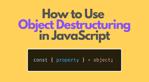
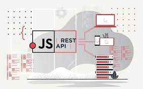

# Lecture4-April
# Homework
## _Array_

[
    
### An array is an object that holds values (of any type) not particularly in named properties/keys, but rather in numerically indexed position In JavaScript, an array is an ordered list of values. Each value is called an element specified by an index. ... First, an array can hold values of mixed types.

## _Array methods_

- ## pop() 

- ## push()

- ## unshift()

- ## toString()

- ## splice()

- ## reverse()

- ## concat()
- ## join() 

- ## map()

- ## filter()
- ## find() 

- ## reduce()

- ## forEach()
- ##  sort() 

- ## indexOf()

- ## includes()
# Array methods

- ### `pop()`
> The `pop()` method removes the last element from an array and returns that element. This method changes the length of the array.
```
const plants = ['broccoli', 'cauliflower', 'cabbage', 'kale', 'tomato'];

console.log(plants.pop());
// Expected output: "tomato"
```

- ### `push()`
> The `push()` method adds one or more elements to the end of an array and returns the new length of the array.
```
const animals = ['pigs', 'goats', 'sheep'];

const count = animals.push('cows');
console.log(count);
// Expected output: 4
console.log(animals);
// Expected output: Array ["pigs", "goats", "sheep", "cows"]
```

- ### `unshift()`
>The `unshift()` method adds one or more elements to the beginning of an array and returns the new length of the array.
```
const array1 = [1, 2, 3];

console.log(array1.unshift(4, 5));
// Expected output: 5

console.log(array1);
// Expected output: Array [4, 5, 1, 2, 3]
```

- ### `toString()`
> The `toString()` method returns a string representing the specified array and its elements.
```
const array1 = [1, 2, 'a', '1a'];

console.log(array1.toString());
// Expected output: "1,2,a,1a"
```

- ### `splice()` 
>The `splice()` method changes the contents of an array by removing or replacing existing elements and/or adding new elements in place. To access part of an array without modifying it, see slice().
```
const months = ['Jan', 'March', 'April', 'June'];
months.splice(1, 0, 'Feb');
// Inserts at index 1
console.log(months);
// Expected output: Array ["Jan", "Feb", "March", "April", "June"]  
```

- ### `reverse()`
>The `reverse()` method reverses an array in place and returns the reference to the same array, the first array element now becoming the last, and the last array element becoming the first. In other words, elements order in the array will be turned towards the direction opposite to that previously stated.
```
const array1 = ['one', 'two', 'three'];
console.log('array1:', array1);
// Expected output: "array1:" Array ["one", "two", "three"]

const reversed = array1.reverse();
console.log('reversed:', reversed);
// Expected output: "reversed:" Array ["three", "two", "one"]
```


- ### `concat ()`
>The `concat()` method is used to merge two or more arrays. This method does not change the existing arrays, but instead returns a new array.
```
const array1 = ['a', 'b', 'c'];
const array2 = ['d', 'e', 'f'];
const array3 = array1.concat(array2);

console.log(array3);
// Expected output: Array ["a", "b", "c", "d", "e", "f"]
```


- ### `join()`
>The `join()` method creates and returns a new string by concatenating all of the elements in an array (or an array-like object), separated by commas or a specified separator string. If the array has only one item, then that item will be returned without using the separator.
```
const elements = ['Fire', 'Air', 'Water'];

console.log(elements.join());
// Expected output: "Fire,Air,Water"

console.log(elements.join(''));
// Expected output: "FireAirWater"

console.log(elements.join('-'));
// Expected output: "Fire-Air-Water"
```

- ### `map()`
>The `map()` method creates a new array populated with the results of calling a provided function on every element in the calling array.
```
const array1 = [1, 4, 9, 16];

// Pass a function to map
const map1 = array1.map(x => x * 2);

console.log(map1);
// Expected output: Array [2, 8, 18, 32]
```

- ### `filter()`
>The `filter()` method creates a shallow copy of a portion of a given array, filtered down to just the elements from the given array that pass the test implemented by the provided function.
```
const words = ['spray', 'limit', 'elite', 'exuberant', 'destruction', 'present'];

const result = words.filter(word => word.length > 6);

console.log(result);
// Expected output: Array ["exuberant", "destruction", "present"]
```

- ### `find()`
>The `find()` method returns the first element in the provided array that satisfies the provided testing function. If no values satisfy the testing function, undefined is returned.
```
const array1 = [5, 12, 8, 130, 44];

const found = array1.find(element => element > 10);

console.log(found);
// Expected output: 12
```

- ### `reduce()`
>The `reduce()` method executes a user-supplied "reducer" callback function on each element of the array, in order, passing in the return value from the calculation on the preceding element. The final result of running the reducer across all elements of the array is a single value.
```
const array1 = [1, 2, 3, 4];

// 0 + 1 + 2 + 3 + 4
const initialValue = 0;
const sumWithInitial = array1.reduce(
  (accumulator, currentValue) => accumulator + currentValue,
  initialValue
);

console.log(sumWithInitial);
// Expected output: 10
```

- ### `forEach()`
>The `forEach()` method executes a provided function once for each array element.
```
const array1 = ['a', 'b', 'c'];

array1.forEach(element => console.log(element));

// Expected output: "a"
// Expected output: "b"
// Expected output: "c"
```
- ### `sort()`
>The sort() method sorts the elements of an array in place and returns the  reference to the same array, now sorted. The default sort order is ascending, built upon converting the elements into strings, then comparing their sequences of UTF-16 code units values.
```
const months = ['March', 'Jan', 'Feb', 'Dec'];
months.sort();
console.log(months);
// Expected output: Array ["Dec", "Feb", "Jan", "March"]

const array1 = [1, 30, 4, 21, 100000];
array1.sort();
console.log(array1);
// Expected output: Array [1, 100000, 21, 30, 4]
```

-  ### `indexOf()`
>The indexOf() method returns the first index at which a given element can be found in the array, or -1 if it is not present.
```
const beasts = ['ant', 'bison', 'camel', 'duck', 'bison'];

console.log(beasts.indexOf('bison'));
// Expected output: 1

// Start from index 2
console.log(beasts.indexOf('bison', 2));
// Expected output: 4
```

- ### `includes()`
>The `includes()` method determines whether an array includes a certain value among its entries, returning true or false as appropriate.
```
const array1 = [1, 2, 3];

console.log(array1.includes(2));
// Expected output: true

const pets = ['cat', 'dog', 'bat'];

console.log(pets.includes('cat'));
// Expected output: true
```


  # `Destructuring`
>The destructuring assignment syntax is a JavaScript expression that makes it possible to unpack values from arrays, or properties from objects, into distinct variables.

```
let a, b, rest;
[a, b] = [10, 20];

console.log(a);
// Expected output: 10

console.log(b);
// Expected output: 20

[a, b, ...rest] = [10, 20, 30, 40, 50];

console.log(rest);
// Expected output: Array [30, 40, 50]
```


 # `Spread`
>The spread (...) syntax allows an iterable, such as an array or string, to be expanded in places where zero or more arguments (for function calls) or elements (for array literals) are expected.

```
function sum(x, y, z) {
  return x + y + z;
}

const numbers = [1, 2, 3];

console.log(sum(...numbers));
// Expected output: 6

console.log(sum.apply(null, numbers));
// Expected output: 6
```

 # `Rest`
>The rest parameter syntax allows a function to accept an indefinite number of arguments as an array, providing a way to represent variadic functions in JavaScript.

```
function sum(...theArgs) {
  let total = 0;
  for (const arg of theArgs) {
    total += arg;
  }
  return total;
}

console.log(sum(1, 2, 3));
// Expected output: 6

console.log(sum(1, 2, 3, 4));
// Expected output: 10

```

